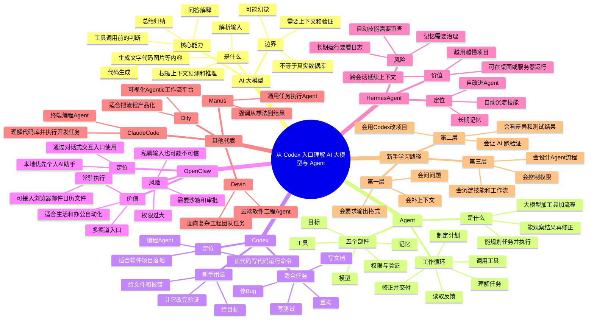

# 从 Codex 入口理解 AI 大模型与 Agent

面向新手的核心结论：

- `大模型` 负责理解、生成、推理和调用工具前的判断。
- `Agent` 是把大模型接上目标、工具、记忆、权限和反馈循环之后，能持续完成任务的系统。
- `Codex` 是编程场景的 Agent 入口。
- `OpenClaw`、`Hermes Agent` 代表更常驻、更个人化、更自动化的 Agent 形态。

## 脑图



## 讲给新手听

### 1. 大模型不是神，是一个强大的“语言与模式引擎”

大模型可以把你的输入拆成很多上下文片段，然后根据训练中学到的语言、代码、知识和模式，生成最可能有用的输出。它能解释概念、总结资料、写代码、改文案、分析报错，也能根据工具返回的信息继续判断下一步。

但它不是绝对正确的数据库。它可能出现上下文误配、事实性偏离，也会在缺少文件、报错、环境信息时输出空泛答案。所以新手最重要的不是背模型名称，而是学会给清楚的任务、足够的上下文和明确的验收标准。

### 2. Agent 是“会动手的大模型系统”

普通对话式交互模型更像“回答问题的人”。Agent 更像“带工具的执行者”。它通常由五部分组成：

- `目标`：要完成什么。
- `模型`：负责理解、规划、判断。
- `工具`：浏览器、代码编辑器、命令行、数据库、邮箱、日历、API。
- `记忆`：保存项目背景、用户偏好、历史任务。
- `权限与验证`：限制它能做什么，并检查结果是否可靠。

一句话：`大模型负责想，工具负责做，Agent负责把想和做串起来。`

### 3. Codex 是最适合从“可落地任务”入门的 Agent

从 Codex 入口学 AI，优势是结果很容易验证。你可以让它读一个目录、解释一段代码、修一个 Bug、写一个测试、生成一份文档。它不只是聊天，而是能在项目目录里读文件、改文件、运行命令，并把结果交付出来。

新手应该这样提需求：

```text
目标：帮我修复这个报错。
上下文：项目目录是 xxx，报错如下 xxx。
约束：不要重构无关代码，不要删除已有文件。
验收：修完后运行测试，并告诉我改了什么。
```

### 4. OpenClaw：更像“常驻在你电脑和对话式交互入口里的个人助理”

OpenClaw 的重点不是写一段回答，而是通过 WhatsApp、Telegram、Slack、Discord 等入口接收任务，并连接浏览器、邮箱、日历、文件、GitHub 等工具去执行。它更像一个常驻助理，适合收邮件、查资料、安排日程、跑脚本、处理重复办公任务。

它的关键价值是“本地优先”和“多渠道入口”。但这也意味着风险更高，因为它可能接触真实账号、真实文件和真实外部系统。新手不要一上来就给它邮箱、支付、生产服务器等高权限，应该先从低风险任务开始，并开启审批、日志、沙箱或最小权限配置。

### 5. Hermes Agent：更像“会长期记忆和自我沉淀技能的个人 Agent”

Hermes Agent 的重点是长期运行、跨会话记忆和自改进。它会从历史任务里沉淀经验，形成技能，并在后续任务里复用。适合长期项目、个人研究、持续运营、自动化助理这类需要“越用越懂你”的场景。

但长期记忆不是越多越好。记错的内容、过时的偏好、敏感信息都可能影响后续判断。所以使用这类 Agent 时，要定期清理记忆、审查自动生成的技能，并保留操作日志。

### 6. 其他 Agent 应该按场景理解，不要只按名字追热点

| Agent / 平台 | 新手理解 | 适合场景 | 注意点 |
| --- | --- | --- | --- |
| Codex | 编程 Agent | 读代码、改代码、跑测试、写文档 | 需要给项目上下文和验收标准 |
| OpenClaw | 常驻个人助理 Agent | 聊天入口、邮件、日历、浏览器、文件自动化 | 权限和安全边界最重要 |
| Hermes Agent | 自改进记忆型 Agent | 长期项目、持续研究、技能沉淀 | 记忆和自动技能需要治理 |
| Claude Code | 终端编程 Agent | 命令行里的代码理解和开发任务 | 注意本机文件、shell、网络权限 |
| Devin | 云端软件工程 Agent | 团队级工程任务、复杂多仓库工作 | 适合工程流程，不是万能程序员 |
| Manus | 通用执行型 Agent | 资料整理、网站、文档、自动化任务 | 要检查中间过程和最终事实 |
| Dify | Agentic 工作流平台 | 把 RAG、工具、流程做成产品 | 适合流程化，不适合完全放任自治 |

## 新手学习路线

### 阶段一：先学会用大模型

- 能把问题说清楚。
- 能补充上下文。
- 能要求固定输出格式。
- 能判断回答是否可靠。

### 阶段二：再学会用 Codex

- 让 Codex 读项目结构。
- 让 Codex 根据报错定位问题。
- 让 Codex 修改文件。
- 让 Codex 运行测试或命令验证。

### 阶段三：再理解 Agent

- 一个 Agent 不只是一个模型。
- 一个 Agent 至少要有目标、工具、权限和反馈。
- 多 Agent 不是越多越好，只有任务能拆分时才有价值。
- 真正难的是验证、权限、记忆和异常处理。

### 阶段四：最后再玩常驻 Agent

- 先从无害任务开始，比如资料整理、提醒、草稿、测试项目。
- 不要直接接生产账号、支付账号、公司核心资料。
- 所有外部动作默认需要人审。
- 所有长期运行都要有日志、回滚和停止开关。

## 最小安全原则

- `最小权限`：只给完成任务必须的权限。
- `人类审批`：发邮件、删文件、付款、改生产系统前必须确认。
- `可观察`：保留日志、工具调用记录和关键输出。
- `可回滚`：重要操作要能撤销。
- `可隔离`：高风险任务放沙箱、测试环境或临时账号。
- `可验证`：最终结果必须能被测试、复查或人工确认。

## 一句话总图

```text
大模型 = 会理解和生成的脑
工具 = 手
记忆 = 笔记本
权限 = 边界
反馈 = 眼睛
Agent = 把脑、手、笔记本、边界和眼睛连起来的执行系统
Codex = 编程场景里的 Agent 入口
OpenClaw / Hermes = 更常驻、更个人化、更自动化的 Agent 形态
```

## 来源与核对时间

核对时间：2026-06-15。

- OpenAI Codex：<https://developers.openai.com/codex>
- OpenAI Agents SDK：<https://developers.openai.com/api/docs/guides/agents>
- OpenAI Agents SDK Python 文档：<https://openai.github.io/openai-agents-python/agents/>
- OpenClaw 官网：<https://openclaw.ai/>
- OpenClaw GitHub：<https://github.com/openclaw/openclaw>
- Hermes Agent 官网：<https://hermes-agent.nousresearch.com/>
- Hermes Agent GitHub：<https://github.com/NousResearch/hermes-agent>
- Claude Code GitHub：<https://github.com/anthropics/claude-code>
- Devin 官网：<https://devin.ai/>
- Manus 官网：<https://manus.im/>
- Dify 官网：<https://dify.ai/>
