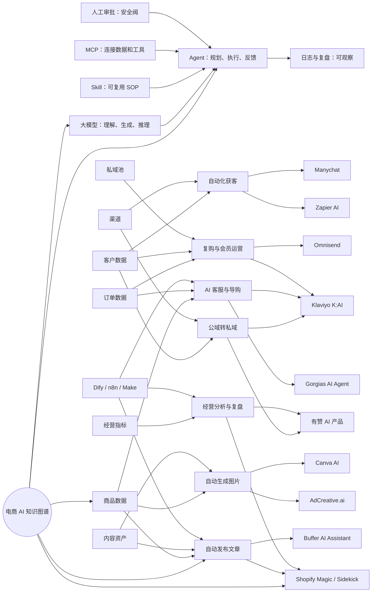

# 电商 AI 工作流与 Agent 知识图谱

面向新手的核心判断：

- `大模型` 负责解析输入、生成内容，并在上下文内完成推理判断。
- `Agent` 是能基于目标规划步骤并调用工具的执行系统，通常包含模型、工具、记忆、权限、反馈。
- `Skill` 是可复用的做事方法，相当于标准作业流程、提示词、模板、脚本和检查清单。
- `MCP` 是让 AI 应用连接外部系统的标准接口，可先理解成受控的数据和工具连接层。
- 电商 AI 落地不是“让 AI 直接生成爆款文案”，而是把商品、内容、渠道、客户、订单、客服、复购串成可验证的流程。

延伸阅读：[Skill 是什么：给新手看的真实用例讲解](</D:/ai入门/电商AI知识图谱/skill-explained-with-real-cases.md>)

## 知识图谱



## 1. Skill 是什么

新手可以把 `Skill` 理解成“给 Agent 用的作业指导书”。

普通提示词只解决一次问题。Skill 解决的是“同类任务以后都这么做”。它通常包含：

- 任务边界：什么时候该用这个 Skill。
- 操作步骤：先做什么，再做什么。
- 模板：文案模板、表格模板、检查清单。
- 脚本：可重复执行的小工具。
- 验收标准：怎样判断输出合格。

电商里的例子：

- `商品详情页 Skill`：输入商品参数、卖点、人群、禁用词，输出标题、五点描述、详情页结构、SEO 描述。
- `小红书种草 Skill`：输入商品、目标人群、使用场景，输出标题、正文、话题标签、图片脚本、评论引导。
- `私域朋友圈 Skill`：输入活动、价格、库存、用户标签，输出早中晚三条朋友圈、导购话术、跟进 SOP。
- `客服售后 Skill`：输入订单状态、退换货规则、品牌语气，输出符合政策的回复和下一步动作。

一句话：`Skill 管的是“怎么做才稳定”。`

## 2. MCP 是什么

`MCP` 是 Model Context Protocol。新手可以把它理解成“让 AI 安全连接外部系统的标准接口”。

没有 MCP 时，每接一个系统都要单独开发一次。接 Shopify、WordPress、飞书、企微、CRM、广告平台、数据库，都要写不同的对接逻辑。有了 MCP，Agent 可以通过统一方式发现工具、读取资源、调用动作。

电商里的例子：

- 连接商品库：读取 SKU、价格、库存、类目、图片。
- 连接 CMS：创建草稿、上传封面、发布文章。
- 连接 CRM：读取客户标签、写入线索评分、触发跟进任务。
- 连接广告平台：读取消耗、点击、转化、素材表现。
- 连接客服系统：查询订单、退货、物流、优惠券。
- 连接企微或私域系统：创建标签、生成群发素材、推送导购任务。

一句话：`MCP 管的是“Agent 能连到哪里，能做什么动作”。`

## 3. Skill、MCP、Agent 的关系

```text
Skill = 做事方法
MCP = 外部接口
Agent = 按方法调用接口完成任务的人
```

例如“自动发布一篇新品文章”：

- Skill 告诉 Agent：文章要有标题、大纲、SEO 描述、CTA、合规检查。
- MCP 让 Agent 读取商品库、上传图片、创建 CMS 草稿、排程社媒。
- Agent 负责把整个流程串起来，并在失败时重试或交给人审。

## 4. 电商常用 AI 工作流

### 4.1 自动发布文章

适合场景：新品上架、活动预热、类目科普、SEO 长尾词、品牌故事。

流程：

```text
商品数据 -> 关键词 -> 文章大纲 -> 草稿 -> 配图 -> 合规检查 -> 人审 -> 发布 -> 社媒分发 -> 数据回流
```

Agent 例子：

- 输入：商品名称、SKU、目标关键词、活动价格、品牌语气。
- Skill：SEO 文章写作 SOP、禁用词检查、CTA 模板。
- MCP/工具：商品库、CMS、图片库、Buffer 或其他社媒排程工具、数据统计。
- 输出：文章 URL、摘要、社媒短文案、下一轮优化建议。
- 验收：标题不夸大，图片可商用，链接可访问，UTM 参数正确，内容符合平台规则。

### 4.2 自动生成图片

适合场景：商品主图、种草图、广告图、朋友圈海报、活动 Banner。

流程：

```text
商品图/素材 -> 品牌规范 -> 场景提示词 -> 多尺寸生成 -> 品牌一致性检查 -> 人审 -> 上传素材库 -> 投放或发布
```

Agent 例子：

- 输入：商品白底图、品牌色、目标平台、小红书或 Instagram 风格、活动文案。
- Skill：电商图生成提示词模板、平台尺寸表、品牌风格检查清单。
- MCP/工具：Canva、AdCreative.ai、图片存储、商品素材库、广告平台。
- 输出：主图、详情页图、社媒图、广告图、多尺寸版本。
- 验收：商品不变形，文字无错别字，价格正确，品牌元素一致，版权风险可控。

### 4.3 自动化获客

适合场景：短视频评论、直播间互动、广告线索、落地页表单、优惠券领取。

流程：

```text
公域内容/广告 -> 用户互动 -> 自动私信/表单 -> 线索评分 -> CRM入库 -> 跟进任务 -> 转化记录
```

Agent 例子：

- 输入：用户来源、评论内容、点击行为、表单字段、商品兴趣。
- Skill：线索评分规则、首轮私信话术、优惠券发放规则。
- MCP/工具：Manychat、广告平台、表单系统、CRM、短信/邮件系统。
- 输出：客户标签、跟进优先级、自动回复、销售提醒。
- 验收：不骚扰用户，不违规抓取数据，线索来源可追踪，销售跟进有记录。

### 4.4 公域转私域

适合场景：抖音/小红书/Instagram/TikTok/广告流量沉淀到企微、WhatsApp、邮件、短信或会员体系。

流程：

```text
公域触点 -> 诱因设计 -> 加好友/订阅/入群 -> 欢迎SOP -> 标签分层 -> 内容培育 -> 首单/复购
```

Agent 例子：

- 输入：来源渠道、用户兴趣、领取权益、购买历史。
- Skill：欢迎语、三天破冰 SOP、七天转化 SOP、老客复购 SOP。
- MCP/工具：企微 SCRM、WhatsApp、邮件短信平台、会员系统、优惠券系统。
- 输出：客户标签、欢迎消息、群发计划、导购跟进任务、复购提醒。
- 验收：用户授权明确，群发频率合规，标签准确，导购动作可追踪。

### 4.5 AI 客服与导购

适合场景：售前问答、尺码推荐、物流查询、退换货、优惠券、加购提醒。

流程：

```text
用户问题 -> 意图识别 -> 查订单/库存/政策 -> 生成回复 -> 可执行动作 -> 人工接管 -> 质检复盘
```

Agent 例子：

- 输入：用户问题、商品、订单、物流、会员等级、客服政策。
- Skill：退换货政策、导购话术、升级人工规则。
- MCP/工具：Gorgias、Klaviyo Customer Agent、Shopify、ERP、物流系统。
- 输出：客服回复、推荐商品、优惠券、售后动作、人工接管摘要。
- 验收：不承诺不存在的政策，不泄露隐私，复杂投诉转人工。

### 4.6 复购与会员运营

适合场景：弃购挽回、老客唤醒、生日关怀、周期购、会员分层、VIP 专属权益。

流程：

```text
客户分层 -> 购买周期预测 -> 内容生成 -> 邮件/短信/私域触达 -> 优惠策略 -> 复购追踪
```

Agent 例子：

- 输入：RFM 分层、最近购买、客单价、偏好、渠道偏好。
- Skill：生命周期营销 SOP、优惠策略边界、会员权益模板。
- MCP/工具：Klaviyo、Omnisend、CRM、优惠券、订单系统。
- 输出：分层人群、触达文案、自动化 Flow、复购看板。
- 验收：退订可用，频率可控，优惠不伤毛利，效果可复盘。

### 4.7 经营分析与复盘

适合场景：日报、周报、活动复盘、广告复盘、库存预警、客服质检。

流程：

```text
订单/广告/客服/内容数据 -> 指标清洗 -> 异常发现 -> 原因假设 -> 优化任务 -> 下周复盘
```

Agent 例子：

- 输入：GMV、转化率、客单价、广告 ROAS、退款率、客服响应、库存。
- Skill：经营日报模板、异常归因框架、行动项模板。
- MCP/工具：BI、Shopify、广告平台、客服系统、库存系统、飞书/Slack。
- 输出：经营报告、风险提醒、优先级任务、负责人和截止时间。
- 验收：数字口径一致，结论可追溯，建议能执行。

## 5. 市场上已落地项目长什么样

| 类型 | 代表项目 | 已落地形态 | 新手怎么理解 |
| --- | --- | --- | --- |
| 店铺内 AI 助手 | Shopify Magic / Sidekick | 在 Shopify 后台生成文案、理解店铺数据、辅助店铺操作 | 电商后台里的 AI 运营助理 |
| 营销自动化 Agent | Klaviyo K:AI | 生成 campaign/flow、客服 Agent、个性化触达、MCP 连接 | 邮件短信和 CRM 的 AI 大脑 |
| 电商客服 Agent | Gorgias AI Agent | 自动处理订单查询、退货、FAQ、折扣、售前导购 | 电商客服与导购一体化 Agent |
| 社媒私信自动化 | Manychat | Instagram/WhatsApp/Messenger 自动回复、关注后私信、转化引导 | 把评论和私信变成线索入口 |
| 邮件短信自动化 | Omnisend | 弃购挽回、欢迎流、复购流、邮件短信营销 | 中小电商常用的自动化营销平台 |
| 跨应用自动化 | Zapier AI | 连接 9000+ 应用，做 AI workflow 和 Agent | 不写代码串联工具的自动化平台 |
| 设计与图片生成 | Canva AI | 生成图片、设计、社媒素材、品牌视觉 | 运营也能做图的 AI 设计台 |
| 广告素材生成 | AdCreative.ai | 批量生成广告图、视频、文案和多尺寸素材 | 面向投放的素材生产机器 |
| 社媒内容生成 | Buffer AI Assistant | 生成、改写、适配多平台社媒内容 | 社媒排程工具里的 AI 文案助手 |
| 中国私域/新零售 | 有赞 AI 产品 | 朋友圈托管、私域 AI 助手、AI 商品图、AI 海报、会员运营 | 围绕微信生态和新零售的 AI 运营套件 |
| 自建 Agent 工作流 | Dify / n8n / Make | 可视化编排 RAG、工具调用、自动化流程 | 把企业自己的 SOP 做成 AI 应用 |

## 6. 一套电商 Agent 系统应该长什么样

```text
数据层：商品、库存、订单、客户、内容、广告、客服、私域
连接层：MCP / API / Webhook / 数据库 / 文件
能力层：大模型、图像模型、语音模型、搜索、RAG
方法层：Skill、SOP、模板、检查清单、品牌规范
执行层：文章Agent、图片Agent、获客Agent、客服Agent、私域Agent、复盘Agent
治理层：权限、日志、人工审批、合规、回滚、效果评估
```

初创团队不要一开始就做“大而全 Agent”。建议从三个最有 ROI 的流程开始：

- `内容生产`：商品详情页、文章、小红书笔记、社媒贴文。
- `客户承接`：评论私信、表单、企微/WhatsApp/邮件订阅。
- `客服导购`：订单查询、FAQ、售后政策、商品推荐。

## 7. 新手落地顺序

1. 先做内容生成：风险低，容易人审。
2. 再做图片生成：提升效率，但必须保留人工核校。
3. 再做文章和社媒排程：引入 CMS 和 Buffer 等发布工具。
4. 再做获客自动化：接表单、评论、私信、CRM。
5. 再做私域 SOP：标签、欢迎语、群发、导购跟进。
6. 最后做客服和订单动作：因为涉及用户权益、退款、物流和隐私。

## 8. 安全底线

- 不要让 Agent 直接删除商品、改价格、发大额优惠券，除非有审批。
- 不要让 Agent 自动承诺退款、赔偿、医疗功效、投资收益等敏感内容。
- 所有自动群发、短信、邮件都要符合平台规则和用户授权。
- 图片生成必须检查商标、肖像、版权、价格、规格。
- 客户数据只给完成任务所需的最小字段。
- 所有关键动作要有日志和回滚路径。

## 来源

核对时间：2026-06-15。

- OpenAI Codex Skills：<https://developers.openai.com/codex/skills>
- Model Context Protocol：<https://modelcontextprotocol.io/docs/getting-started/intro>
- MCP Tools 规范：<https://modelcontextprotocol.io/specification/2025-06-18/server/tools>
- Shopify Magic：<https://help.shopify.com/en/manual/shopify-admin/productivity-tools/shopify-magic>
- Shopify Sidekick：<https://www.shopify.com/sidekick>
- Klaviyo K:AI：<https://www.klaviyo.com/solutions/ai>
- Gorgias AI Agent：<https://www.gorgias.com/ai-agent>
- Manychat Instagram：<https://manychat.com/product/instagram>
- Omnisend：<https://www.omnisend.com/>
- Zapier AI：<https://zapier.com/>
- Canva AI Image Generator：<https://www.canva.com/ai-image-generator/>
- AdCreative.ai：<https://www.adcreative.ai/>
- Buffer AI Assistant：<https://buffer.com/ai-assistant>
- 有赞产品中心：<https://www.youzan.com/chanpin>
- Dify：<https://dify.ai/>
